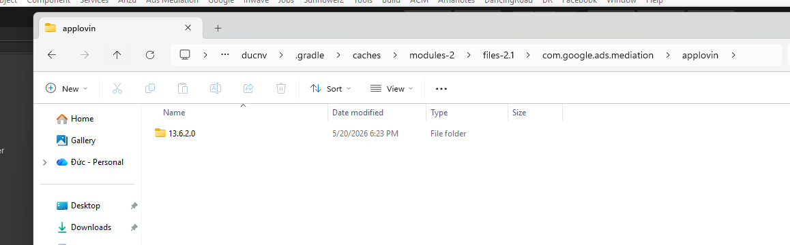
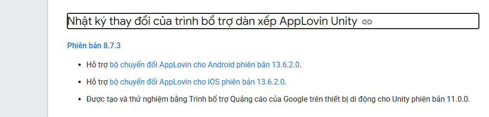
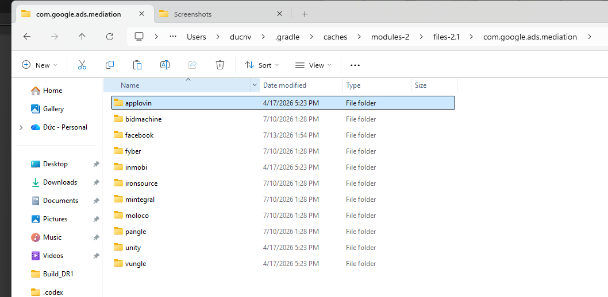
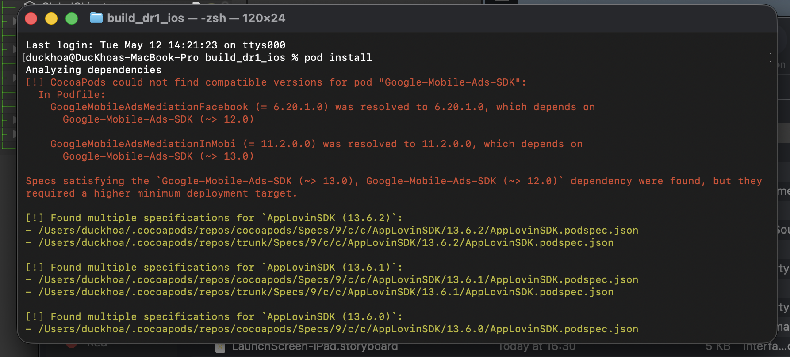
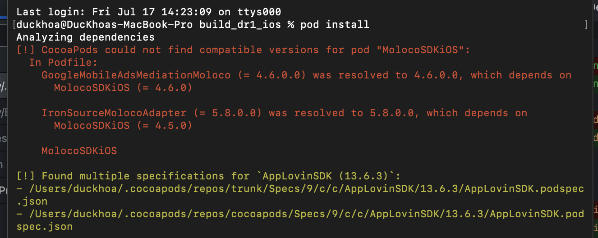

# Advertising Note
## Lời nói đầu
Đây không phải tài liệu dạy bạn cách tích hợp quảng cáo vào Unity, vì các mediation SDK đều đã có tài liệu hướng dẫn đầy đủ.
Tài liệu này chỉ nhằm mục đích cung cấp những lưu ý quan trọng khi bạn làm việc với quảng cáo trong Unity, giúp bạn đi nhanh hơn và tránh những sai lầm phổ biến.

## 1. Tài liệu về quảng cáo trong Unity

### 1.1 Google mobile ads
Mọi người còn hay gọi là Admob.
- [Repository](https://github.com/googleads/googleads-mobile-unity/)
- [Release](https://github.com/googleads/googleads-mobile-unity/releases)
- [Issues](https://github.com/googleads/googleads-mobile-unity/issues)

Để tích hợp admob vào unity bạn có thể dùng các các cách sau:
- Cách 1: Dùng Unity Package Manager (UPM) để cài đặt
Đăng ký scope cho UPM:
```json
{
  "scopedRegistries": [
    {
      "name": "OpenUPM",
      "url": "https://package.openupm.com",
      "scopes": [
        "com.google"
      ]
    }
  ]
}
```
sau đó vào Package Manager, chọn My Registries, tìm Google Mobile Ads for Unity và install.
- Cách 2: Download file .unitypackage từ release và import vào project của bạn.
- Cách 3: mở manifest.json của project và thêm dòng sau vào dependencies:
```json
"com.google.ads.mobile": "https://github.com/googleads/googleads-mobile-unity.git?path=packages/com.google.ads.mobile#v11.0.0",      
```

Sau khi install xong thì bạn có thể xem [docs](https://developers.google.com/admob/unity/quick-start?hl=vi) và [sample code](https://github.com/googleads/googleads-mobile-unity/tree/main/samples/HelloWorld/Assets/Scripts) 
để tham khảo và tích hợp vào project của bạn.

### 1.2 AppLovin Max

- [Repository](https://github.com/AppLovin/AppLovin-MAX-Unity-Plugin)
- [Release](https://github.com/AppLovin/AppLovin-MAX-Unity-Plugin/releases)
- [Issues](https://github.com/AppLovin/AppLovin-MAX-Unity-Plugin/issues)

Để tích hợp AppLovin Max vào Unity bạn có thể download file .unitypackage từ release và import vào project của bạn.
Sau khi import xong thì bạn có thể xem [docs](https://support.applovin.com/en/max/unity/overview/integration) và [sample code](https://github.com/AppLovin/AppLovin-MAX-Unity-Plugin/tree/master/DemoApp)
để tham khảo và tích hợp vào project của bạn.

### 1.3 LevelPlay

- [Repository](https://github.com/ironsource-mobile/Unity-sdk)
- [Release](https://github.com/ironsource-mobile/Unity-sdk/releases)
- [Changelog](https://docs.unity.com/en-us/grow/levelplay/sdk/android/changelog)

Để tích hợp LevelPlay vào Unity bạn có thể download file .unitypackage từ release và import vào project của bạn hoặc dùng Unity Package Manager (UPM) để cài đặt AdsMediation (com.unity.services.levelplay).

## 2. Lưu ý khi làm việc với quảng cáo trong Unity

### 2.1 Lưu ý trước khi build test
- Trước khi thực hiện build test hãy lưu ý các vấn đề sau:

***Đối với Admob***
- [ ] Admob có hỗ trợ [ad unit id test](https://developers.google.com/admob/unity/test-ads?hl=en)
- [ ] Admob hỗ trợ tính năng [Ad Inspector](https://developers.google.com/admob/unity/ad-inspector?hl=en) để debug quảng cáo trong quá trình test.
- [ ] Nếu sử dụng GDPR của admob (thường trong logic code sẽ có điều kiện show GDPR consent thỏa mãn thì mới load ads) thì bạn cần bật GDPR message trong Admob dashboard để test, nếu không bật thì sẽ không show GDPR => không load được ads.

***Đối với Applovin Max***
- [ ] Applovin Max không có hỗ trợ ad unit id test giống Admob
- [ ] Applovin Max có hỗ trợ tính năng [Mediation Debugger](https://support.applovin.com/en/max/unity/testing-networks/mediation-debugger) để debug quảng cáo trong quá trình test.
- [ ] Sẽ không có ads trả về nếu bundle id trong project không khớp với bundle id trong dashboard của Applovin Max, hãy kiểm tra kỹ trước khi build test.

***Đối với LevelPlay***
- [ ] LevelPlay không có hỗ trợ ad unit id test giống Admob
- [ ] LevelPlay có hỗ trợ tính năng [Test Suite](https://docs.unity.com/en-us/grow/levelplay/sdk/unity/integration-test-suite) để debug quảng cáo trong quá trình test.

### 2.2 Trước khi update version SDK thì nên làm gì?
- [ ] Trước khi update version SDK thì nên đọc kỹ changelog của SDK để nắm được các thay đổi trong các version mới, tránh việc update xong bị lỗi không biết nguyên nhân do đâu.
[Google mobile ads changelog](https://github.com/googleads/googleads-mobile-unity/releases)
[AppLovin Max changelog](https://github.com/AppLovin/AppLovin-MAX-Unity-Plugin/releases)
[LevelPlay changelog](https://docs.unity.com/en-us/grow/levelplay/sdk/android/changelog)

- [ ] Nếu có bug hoặc lỗi phát sinh sau khi update version SDK thì nên vào phần issue từ repo github của SDK để tìm kiếm xem có ai gặp lỗi tương tự không, nếu không thì hãy tìm tới các nguồn thông tin khác.
- [ ] Lưu ý: Repo của LevelPlay không có phần issue

### 2.3 Lưu ý về callback
- [ ] Theo tài liệu của cả 3 mediation đều khuyến cao rằng các callback của quảng cáo nên được gọi trong main thread.
- [ ] Đối với tracking ad_impression nằm trong callback OnAdPaid (Admob), OnAdRevenuePaidEvent (Applovin Max)... thì KHÔNG nên gọi trong main thread vì sẽ gây delay và có ảnh hưởng đến chỉ số tracking.
- [ ] Callback  OnAdRevenuePaidEvent (Applovin Max) và OnImpressionDataReady (LevelPlay) trả về ads info rất đầy đủ. Tuy nhiên callback OnAdPaid (Admob) chỉ trả về AdValue, nếu muốn lấy thêm thông tin về như AdNetwork thì bạn cần phải gọi thêm hàm GetResponseInfo() (tham khảo [docs](https://developers.google.com/admob/unity/response-info?hl=en)).
- [ ] Đối với reward ads, phần callback sẽ có thêm event OnAdReceivedRewardEvent (Applovin Max), OnAdRewarded (LevelPlay), OnUserEarnedReward (Admob). Event này thông báo rằng user đã được nhận reward, dựa vào event này bạn có thể tạo flag và custom thêm cho event CloseAd để bắt được trường hợp user skip reward (trên android).

### 2.4: Kiểm tra tracking ad_impression
- [ ] Nếu bạn sử dụng firebase analytics để tracking ad_impresion thì hãy sủ dụng [debug view](https://firebase.google.com/docs/analytics/debugview?utm_source=google&utm_medium=cpc&utm_campaign=Cloud-SS-DR-Firebase-FY26-global-gsem-1713590&utm_content=text-ad&utm_term=KW_firebase&gclsrc=aw.ds&gad_source=1&gad_campaignid=23417478209&gbraid=0AAAAADpUDOgm7st3XuLn4n5XlxNbn9eN1&gclid=Cj0KCQjwguLSBhDLARIsAH-yPrE2pZYMO_d8o-3LWiliw72kEO_J0WN2sIhiL0V5vp_pB96aubB__64aAk7AEALw_wcB#ios+) của firebase để kiểm tra và chắc chắn răng event đã được bắn thành công lên firebase.
- [ ] Nếu bạn sủ dụng Admob, khi đã connect firebase với Admob thì event ad_impression sẽ được bắn lên tự động. Lúc này hãy trao đổi với bộ phận marketing để nắm được yêu cầu cụ thể và điều chỉnh cho phù hợp.

## 3. Cách quảng cáo được load về và phân phối từ ad network, nguyên nhân conflict giữa các ad network và cách giải quyết.
### 3.1 Cách quảng cáo được load về và phân phối từ ad network
Khi tích hợp quảng cáo và add thêm các adnetwork, bạn sẽ thấy có nhiều file .xml chứa đựng các thông tin config cho adnetwork đó. Vậy vì sao chỉ dựa vào file .xml này mà có thể lấy được quảng cáo từ adnetwork?
- Lúc tôi mới bắt đầu làm việc với quảng cáo, tôi cũng thắc mắc rằng, khi tôi add một ad network vào project thì chỉ thấy git change báo có thêm một file .xml, file này chẳng chứa thứ gì liên quan tới logic vậy sao nó có thể kéo được ads về để show.
- Sau một thời gian tìm hiểu, tôi mới biết rằng, các ad network đều có một server riêng, khi bạn add ad network vào project thì file .xml này sẽ chứa các thông tin config để kết nối tới server của ad network đó.
- Lúc build hoặc lúc resolve thì hệ thống sẽ kéo thư viện của ad network đó về và cache lại trong .gradle, nó thường là các file .aar chứa adapter và sdk của ad network đó.
- Phần adapter sẽ có nhiệm vụ kết nối sdk của ad network đó với mediation chính (ví dụ: Admob, Applovin Max, LevelPlay). Vì trong code của bạn chỉ thao tác với API của mediation chính, nên adapter sẽ là cầu nối để gọi tới sdk của ad network đó.
- Lúc này bộ phận Monet sẽ setup trên dashboard của mediation chính waterfall cho các ad network để phân phối phù hơp.




- Như 2 ảnh minh họa trên, bạn có thể thấy răng tôi tìm thấy thư viện của adapter Applovin có version 13.6.2 trùng với version unity 8.7.3 mà tôi đã add vào cho mediation chính là Admob, nó được cach trong folder .gradle.
- Hoàn toàn có thể tìm thấy nhiều adapter khác của các adnetwork được cache trong đó.



- Sơ đồ tóm tắt đơn giản

```
Dependencies.xml → EDM4U/Gradle resolve → Maven repository / Gradle cache → Mediation SDK + Adapter + Ad Network SDK → Runtime request → Ad Network server → Hiển thị quảng cáo
```

### 3.2 Nguyên nhân conflict giữa các ad network và cách giải quyết
- Đây là vấn đề mà thường xuyên gặp khi tích hợp nhiều mediation sdk vào project và mỗi mediation đều add thêm nhiều ad network khác nhau. Khi đó sẽ xảy ra conflict giữa các ad network với nhau dẫn tới lỗi build hoặc khi build ios sẽ không sinh ra file .workspace.
- Nguyên nhân conflict thường do các ad network ở 2 mediation khác nhau (hoặc cùng mediation) sử dụng cùng dependency nhưng version của dependencies khác nhau.



Hình bên trên là ví dụ minh họa về vấn đề conflict giữa 2 ad network là facebook và inmobi (vì facebook phụ thuộc vào google ads sdk 12.0 còn inmob phụ thuộc vào google ads sdk 13.0).
Để resolve được thì buộc phải đưa 2 medation kia về chung một phụ thuộc. Mình đã chọn nâng version facebook để nó phụ thuộc vào google ads sdk 13.0



Hình bên trên là ví dụ mình họa về vấn đề conflict giữa cùng một ad network là Moloco nhưng ở 2 mediation khác nhau (vì GoogleMobileAdsMediationMoloco đang phụ thuộc vào MolocoSDKiOS 4.6.0 còn IronSourceMolocoAdapter đang phụ thuộc vào MolocoSDKiOS 4.5.0).
Để resolve được thì mình đã chọn nâng version IronSourceMolocoAdapter để nó phụ thuộc vào MolocoSDKiOS 4.6.0

- Bạn có thể nâng/sửa version của các ad network bằng cách sửa file dependencies (.xml) hoặc sửa luôn trong podfile đối với build ios

- Lưu ý: 

- [ ] Hãy kiểm tra changelog của các ad network tìm ra version phù hợp để không bị conflict sự phụ thuộc, đừng nâng version bữa bãi và đợi may mắn.
- [ ] Vì thư viện của các ad network sẽ được tải từ server về nên có trường hợp mất internet hoặc server bị hỏng sẽ không down được thư viện về. Đây là trường hợp khá phổ biến khi mình thực hiện lệnh `pod install` và đã gặp trường hợp báo đường dẫn đến repo chứa version của ad network đó không tồn tại (dường như sau khi lỗi thì nhà phát hành đã xóa version đó đi).